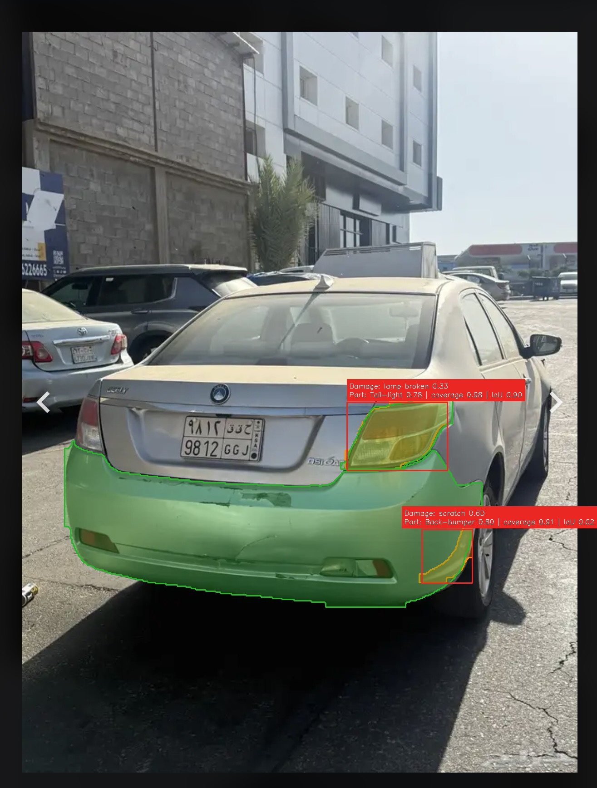

# Car Damage Assessment API


A containerized FastAPI service for automated car damage assessment. It runs a fine-tuned Hugging Face SegFormer semantic-segmentation model for damage and a fine-tuned YOLO26 instance-segmentation model for vehicle parts.

## Table of Contents

- [Key Features](#key-features)
- [Model Weights](#model-weights)
- [Run with Docker](#run-with-docker)
- [Local Development](#local-development)
- [Quick Test](#quick-test)
- [Training](#training)

## Key Features

- **Mixed segmentation stack**: SegFormer damage semantic segmentation plus YOLO26 vehicle-part instance segmentation.
- **Part-guided damage ROI**: The API first segments vehicle parts, crops a padded vehicle region, then runs SegFormer on that crop so real-world full-scene photos keep more damage detail.
- **Mask-aware assessment**: Each damage response includes its polygon, matched part polygon, containment coverage, and mask IoU.
- **Production API surface**: FastAPI, startup checkpoint validation, health checks, structured errors, and CPU/GPU Docker images.
- **Modal training**: Reproducible cloud training scripts for both segmentation models.

## Model Weights

Place the damage model directory and car-parts checkpoint in `models/`:

```bash
mkdir -p models
cp -r /path/to/car_damage_segformer models/car_damage_segformer
cp /path/to/car_parts_best.pt models/car_parts_yolo26_seg.pt
```

Runtime configuration:

```bash
export DAMAGE_MODEL_PATH="./models/car_damage_segformer"
export PARTS_MODEL_PATH="./models/car_parts_yolo26_seg.pt"
export DAMAGE_CONFIDENCE_THRESHOLD="0.30"
export DAMAGE_MIN_AREA="16"
export DAMAGE_ROI_ENABLED="true"
export DAMAGE_ROI_PADDING_RATIO="0.08"
export DAMAGE_ROI_MIN_PADDING="32"
export PART_COVERAGE_THRESHOLD="0.50"
```

The damage path must be a Hugging Face SegFormer model directory. The car-parts checkpoint must have Ultralytics task `segment`. `MODEL_PATH` remains supported as a fallback for `DAMAGE_MODEL_PATH`. `DAMAGE_ROI_ENABLED` runs damage segmentation on a padded crop derived from detected car-part masks; set it to `false` to force full-image SegFormer inference.

## Run with Docker

```bash
docker build -t car-damage-assessment:1.0.0 .
docker run -d \
  -p 8000:8000 \
  -v $(pwd)/models:/app/models \
  --name car-damage-assessment \
  car-damage-assessment:1.0.0
```

After the container has been created, restart it and attach to its logs with:

```bash
docker start -a car-damage-assessment
```

For GPU inference:

```bash
docker build -t car-damage-assessment:1.0.0-gpu -f Dockerfile.gpu .
docker run -d \
  --gpus all \
  -p 8000:8000 \
  -v $(pwd)/models:/app/models \
  --name car-damage-assessment-gpu \
  car-damage-assessment:1.0.0-gpu
```

## Local Development

```bash
python3.11 -m venv venv
source venv/bin/activate

# CPU
pip install torch==2.11.0 torchvision==0.26.0 torchaudio==2.11.0 --index-url https://download.pytorch.org/whl/cpu
pip install -r requirements.txt

export DAMAGE_MODEL_PATH="./models/car_damage_segformer"
export PARTS_MODEL_PATH="./models/car_parts_yolo26_seg.pt"
python -m uvicorn app.main:app --reload --host 0.0.0.0 --port 8000
```

OpenAPI documentation is at [http://localhost:8000/docs](http://localhost:8000/docs).

## Quick Test

```bash
python test.py /path/to/image.jpg --save --window-width 1400 --window-height 900
```

The client draws damage masks in orange, matched part masks in green, and damage boxes in red.

## Training

```bash
cd notebooks

# Damage segmentation, default SegFormer nvidia/mit-b2 on CarDD
modal run modal_car_damage_detection_training.py

# Vehicle-part segmentation, default YOLO26n-seg
modal run modal_car_parts_segmentation_training.py
```

Retrieve the checkpoints:

```bash
modal volume get car-damage-segformer-output-vol \
  /car_damage_segformer_mit_b2/model ./models/car_damage_segformer
modal volume get car-parts-segmentation-output-vol \
  /car_parts_yolo26n_seg/weights/best.pt ./models/car_parts_yolo26_seg.pt
```

See [notebooks/README.md](notebooks/README.md) for training details and [docs/API.md](docs/API.md) for the API contract.
